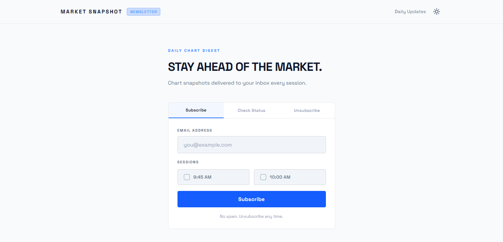
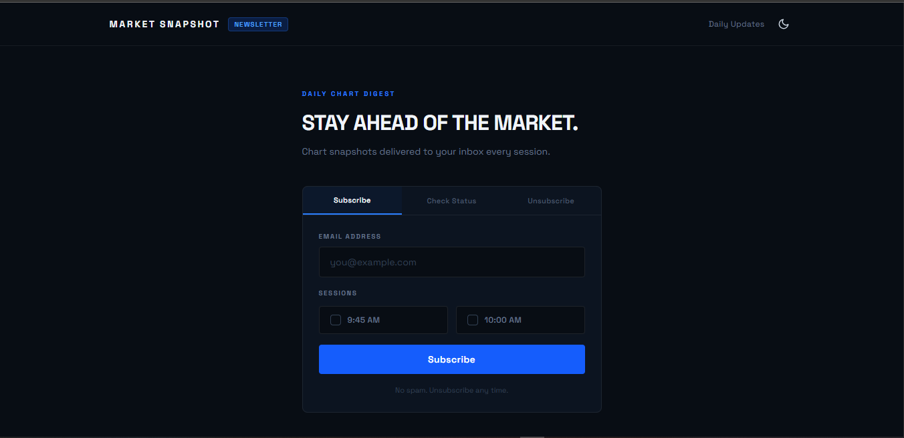
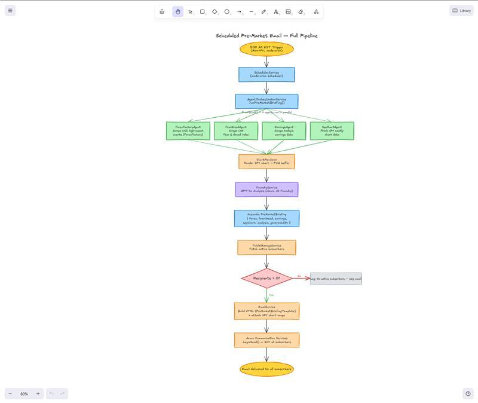

# Trading Daily — Automated Pre-Market Intelligence Platform

Trading Daily is an automated financial intelligence system that delivers actionable pre-market briefings to traders every weekday morning. The platform orchestrates multiple data-collection agents, synthesizes market insights using Azure AI Foundry (GPT-4o), and distributes professional briefings via email all before the U.S. market opens.

---

## Problem Statement

Traders spend significant time each morning gathering data from multiple sources i.e economic calendars, sentiment indicators, earnings reports, and technical charts before they can form a trading plan. This manual process is time consuming, inconsistent, and prone to missing critical information.

Trading Daily solves this by automating the entire pre-market research workflow. Subscribers receive a single, AI analyzed briefing covering all major market factors at 5:30 AM EST, giving them a comprehensive view of the trading day ahead without switching between multiple platforms.

---

## Features and Functionality

### Multi-Agent Data Collection

Four specialized agents run concurrently every weekday morning to gather real time market data:

- **Forex Factory Agent** — Scrapes high impact USD economic events from the ForexFactory calendar, extracting event times, forecasts, actual values, and previous readings.
- **Fear and Greed Agent** — Captures the CNN Fear and Greed Index score and historical comparisons (previous close, 1 week, 1 month, 1 year ago) to gauge market sentiment.
- **Earnings Agent** — Collects upcoming earnings reports from Market Chameleon, including ticker symbols, report timing (pre-market/after-close), expected move percentages, and implied volatility.
- **SPY Chart Agent** — Fetches weekly SPY candle data from TradingView, calculates the 20-week Simple Moving Average, and determines the current trend position relative to the SMA.

### AI-Powered Analysis

All collected data is fed into Azure AI Foundry (GPT-4o) which generates a structured briefing covering:

- Market structure assessment (SPY vs. 20-week SMA trend)
- Market sentiment summary based on the Fear and Greed Index
- Key economic events to watch during the session
- Notable earnings highlights and their potential impact
- Actionable trading considerations
- Overall risk assessment (Low / Moderate / High / Extreme)

### Server-Side Chart Rendering

The platform renders SPY weekly price charts with SMA overlays as PNG images using Chart.js on the server. These charts are embedded directly in the email briefings as visual aids.

### Subscription Management

A full subscription lifecycle is supported through the web interface:

- Email-based subscription with confirmation flow
- Topic selection for different market sessions (9:45 AM and 10:00 AM)
- Subscription status checking
- Unsubscribe with re-subscribe support

### Scheduled Delivery

A cron-based scheduler triggers the full pipeline at 5:30 AM EST, Monday through Friday.

### Responsive Web Interface

The frontend provides a clean subscription management portal with:

- Tabbed interface for subscribe, check status, and unsubscribe flows
- Light and dark mode with system preference detection and manual toggle
- Mobile-responsive layout

|             Light Mode              |             Dark Mode             |
| :---------------------------------: | :-------------------------------: |
|  |  |

---

## Real-World Use Cases

**Independent Day Traders** — Receive a consolidated pre-market briefing instead of manually checking five or more websites each morning. The AI generated risk assessment helps prioritize which sessions to trade actively.

**Swing Traders** — The weekly SPY chart analysis with SMA trend positioning provides a macro context for multi-day trade decisions, delivered consistently without manual chart review.

**Trading Communities and Educators** — Newsletter operators can use Trading Daily as a content backbone, distributing professional-grade market analysis to their audience on a consistent schedule.

**Portfolio Managers** — Stay informed of high-impact economic events and earnings that could affect holdings, with sentiment context from the Fear and Greed Index.

---

## Technology Stack

### Microsoft and Azure Services

| Service                                     | Purpose                                                                                             |
| ------------------------------------------- | --------------------------------------------------------------------------------------------------- |
| **Azure AI Foundry (GPT-4o)**               | Analyzes aggregated market data and generates structured pre-market briefings with risk assessments |
| **Azure Table Storage**                     | Stores and manages subscriber records, confirmation tokens, subscription status, and metadata       |
| **Azure Blob Storage**                      | Hosts chart snapshot images used as email attachments                                               |
| **Azure Container Apps**                    | Hosts the backend API and scheduled agent pipeline with Managed Identity support                    |
| **Azure Static Web Apps**                   | Hosts the frontend subscription portal with SPA routing and security headers                        |
| **Azure Identity (DefaultAzureCredential)** | Provides credential management across Azure services using Managed Identity in production           |
| **Azure Communication Services (Email)**    | Sends transactional emails (subscription confirmations and pre-market briefings) via ACS Email      |

### Frontend

| Technology               | Purpose                                   |
| ------------------------ | ----------------------------------------- |
| **React 19**             | UI framework                              |
| **TypeScript**           | Type-safe development                     |
| **Vite 7**               | Build tooling and development server      |
| **Tailwind CSS 4**       | Utility-first styling                     |
| **TanStack React Query** | Server state management and data fetching |
| **Axios**                | HTTP client for API communication         |
| **React Toastify**       | User notifications                        |

### Backend

| Technology                           | Purpose                                             |
| ------------------------------------ | --------------------------------------------------- |
| **Express.js 5**                     | REST API framework                                  |
| **TypeScript**                       | Type-safe server development                        |
| **Node-Cron**                        | Scheduled task execution                            |
| **Playwright**                       | Headless browser automation for web scraping agents |
| **Azure Communication Services SDK** | Email delivery via ACS Email                        |
| **Chart.js + chartjs-node-canvas**   | Server-side chart rendering to PNG                  |
| **express-rate-limit**               | API rate limiting                                   |
| **Docker**                           | Containerized deployment                            |

### Azure SDKs

- `@azure-rest/ai-inference` — Azure AI Foundry model inference
- `@azure/communication-email` — Azure Communication Services email sending
- `@azure/data-tables` — Azure Table Storage operations
- `@azure/identity` — Managed Identity and credential handling
- `@azure/core-auth` — Shared authentication utilities

---

## Project Structure

```
trading-news/
├── backend/
│   ├── src/
│   │   ├── agents/              # Data collection agents
│   │   │   ├── forexFactoryAgent.ts
│   │   │   ├── fearGreedAgent.ts
│   │   │   ├── earningsAgent.ts
│   │   │   ├── spyChartAgent.ts
│   │   │   └── types.ts
│   │   ├── services/            # Core business logic
│   │   │   ├── agentOrchestratorService.ts
│   │   │   ├── foundryService.ts
│   │   │   ├── schedulerService.ts
│   │   │   ├── emailService.ts
│   │   │   ├── tableStorageService.ts
│   │   │   ├── blobStorageService.ts
│   │   │   └── chartRenderer.ts
│   │   ├── routes/              # API route definitions
│   │   ├── controllers/         # Request handlers
│   │   ├── middleware/          # Auth and rate limiting
│   │   ├── templates/           # Email HTML templates
│   │   └── types/               # Shared TypeScript types
│   ├── Dockerfile
│   └── package.json
├── frontend/
│   ├── src/
│   │   ├── components/          # UI components
│   │   ├── contexts/            # React context providers
│   │   ├── hooks/               # Custom React hooks
│   │   ├── api/                 # API client and endpoints
│   │   ├── types/               # TypeScript type definitions
│   │   └── utils/               # Utility functions
│   ├── staticwebapp.config.json
│   └── package.json
└── README.md
```

---

## API Endpoints

### Agent Routes (`/api/v1/agents`)

| Method | Endpoint         | Description                           |
| ------ | ---------------- | ------------------------------------- |
| POST   | `/agents/run`    | Trigger pre-market briefing on-demand |
| GET    | `/agents/status` | Check scheduler status                |

### Subscription Routes (`/api/v1`)

| Method | Endpoint                | Description                     |
| ------ | ----------------------- | ------------------------------- |
| POST   | `/subscribe`            | Create new subscription         |
| POST   | `/subscription/confirm` | Confirm subscription with token |
| GET    | `/subscription/:email`  | Get subscription details        |
| DELETE | `/subscription/:email`  | Remove subscription             |
| GET    | `/subscriptions`        | List subscriptions by status    |

### Email Routes (`/api/v1`)

| Method | Endpoint     | Description                         |
| ------ | ------------ | ----------------------------------- |
| POST   | `/send-mail` | Send chart snapshots to subscribers |

All routes (except public confirmation) require API key authentication via the `x-api-key` header.

---

## Getting Started

### Prerequisites

- Node.js 20+
- npm
- Azure account with the following resources provisioned:
  - Azure AI Foundry project with GPT-4o deployment
  - Azure Storage account (Table Storage and Blob Storage)
  - Azure Container Apps (for backend deployment)
  - Azure Static Web Apps (for frontend deployment)
- Azure Communication Services resource (for email)

### Backend Setup

```bash
cd backend
npm install
npx playwright install chromium --with-deps
cp .env.example .env
# Fill in environment variables
npm run dev
```

### Frontend Setup

```bash
cd frontend
npm install
cp .env.example .env.local
# Set VITE_API_URL and VITE_API_KEY (local dev values)
npm run dev
```

---

## Environment Variables

### Backend

| Variable                        | Description                                                   |
| ------------------------------- | ------------------------------------------------------------- |
| `ACS_CONNECTION_STRING`         | Azure Communication Services connection string                |
| `ACS_SENDER_ADDRESS`            | ACS MailFrom address (e.g. `DoNotReply@<guid>.azurecomm.net`) |
| `BLOB_STORAGE_BASE_URL`         | Azure Blob Storage base URL                                   |
| `AZURE_STORAGE_ACCOUNT_NAME`    | Azure Storage account name                                    |
| `AZURE_STORAGE_ACCOUNT_KEY`     | Storage account key (local dev only)                          |
| `FOUNDRY_PROJECT_ENDPOINT`      | Azure AI Foundry project endpoint                             |
| `FOUNDRY_MODEL_DEPLOYMENT_NAME` | Model deployment name (e.g. `gpt-4o`)                         |
| `FOUNDRY_API_KEY`               | Azure AI Foundry API key                                      |
| `SEND_MAIL_API_KEY`             | API key for route authentication                              |
| `CORS_ORIGINS`                  | Comma-separated allowed origins (omit to allow all)           |
| `FRONTEND_URL`                  | Frontend URL for confirmation redirects                       |
| `API_URL`                       | Public backend URL (used in confirmation emails)              |
| `ENABLE_SCHEDULER`              | Enable/disable cron scheduler                                 |

### Frontend

| Variable       | Description                        | File                             |
| -------------- | ---------------------------------- | -------------------------------- |
| `VITE_API_URL` | Backend API base URL               | `.env.local` / `.env.production` |
| `VITE_API_KEY` | API key for authenticated requests | `.env.local` / `.env.production` |

> Use `.env.local` for local dev values and `.env.production` for production values. `vite dev` reads `.env.local`; `vite build` reads `.env.production`. Neither file is committed. See `frontend/.env.example` for the full template.

---

## Team Members

| Name | Microsoft Learn Username |
| ---- | ------------------------ |
| Gerardo Arevalo | GerardoArevalo-3702 |
| David Segun | DavidSegun-0630 |

---

## Demo Video

[Link to demo video]

---

## Architecture Diagram


